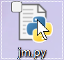

# jm-script
#####批量下载禁漫本子
一个用gpt写的破烂脚本，初衷是有沙比基友不会用jm，让我帮他下本子，然后他copy了一堆本子号……\\
难绷。\\
环境：python\
需要安装以下包
```
pip install jmcomic==2.6.9
pip install pillow
```

下载jm.py,\
\
双击即可使用，会生成文件夹存储本子图片，然后生成对应的pdf，最后删除本子图片。如果想要保留图片，cv代码给gpt就行了。使用中遇到什么问题直接问gpt，因为我也不会。
